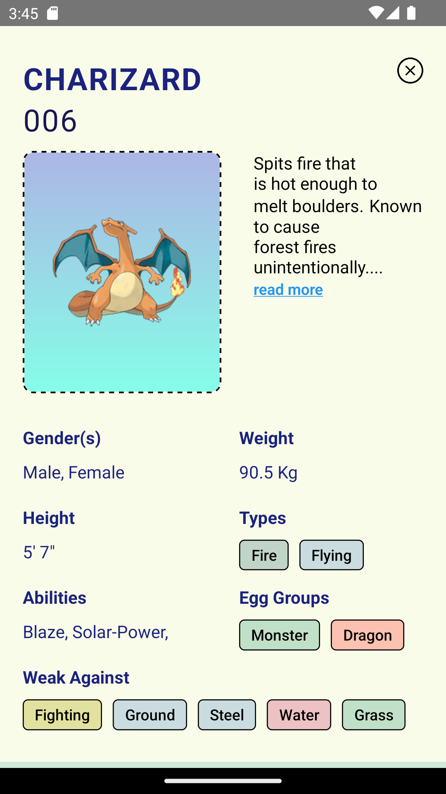
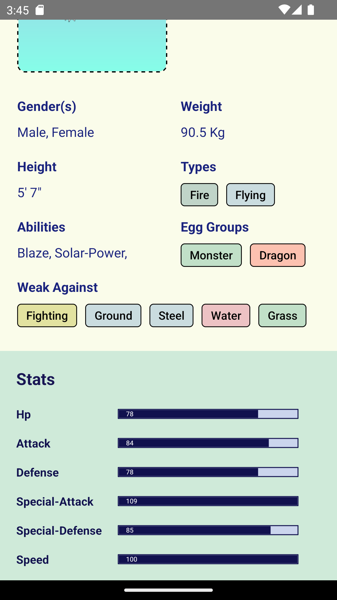
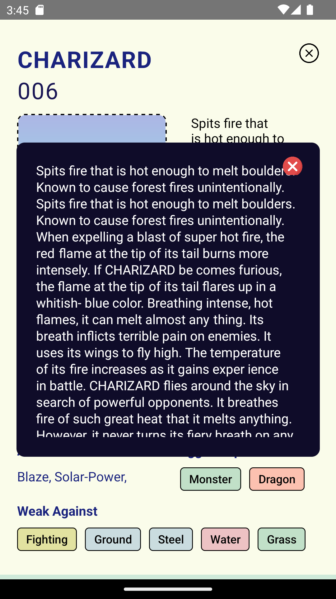

# Pokemon APP

The Pokemon API App is a mobile application built using React Native that allows users to browse and explore information about various Pokemon species. The app utilizes the Pokemon API, a free and open API that provides information about different Pokemon, including their names, types, abilities, and more.

With the Pokemon API App, users can easily search for Pokemon by name, view detailed information about each Pokemon, and even save their favorite Pokemon to a list for future reference. The app provides a fun and engaging way for Pokemon fans to learn more about their favorite characters and explore the vast world of Pokemon.

## Table of Contents

- [Getting Started](#getting-started)
  - [Prerequisites](#prerequisites)
  - [Installation](#installation)
- [Usage](#usage)
- [Contributing](#contributing)
- [License](#license)

## Getting Started

These instructions will get you a copy of the project up and running on your local machine for development and testing purposes.

### Prerequisites

Android Studio
Node.js
ReactNative
CodeEditor

### Installation

# Install the dependencies:

`cd PokemonApps`
`npm install`

# Run the app on a local development server:

`npm start`
`npx react-native run-android`

## Usage

Once the app is running, you can use it to browse through a list of Pokemon, view details about each Pokemon, and search for specific Pokemon by name.

## Technologies Used

`React Native`
`Context API`
`Axios`
`Pokemon API`

## ScreenShots

# screenshot 1

# screenshot 2

# screenshot 3

# screenshot 4

# screenshot 5

# screenshot 6

# screenshot 7

## License

This project is licensed under the MIT License - see the [LICENSE.md](LICENSE.md) file for details.
